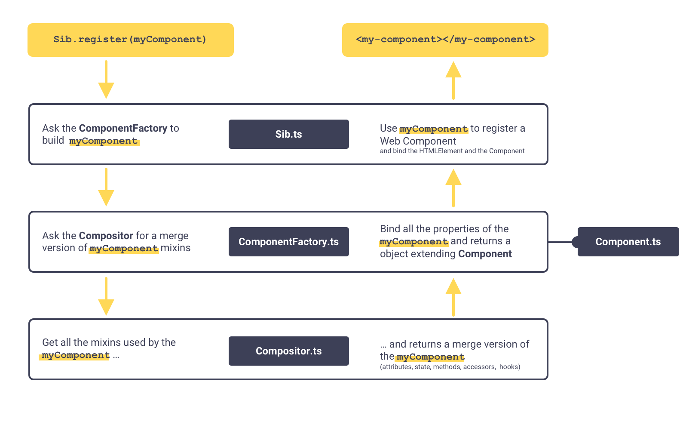
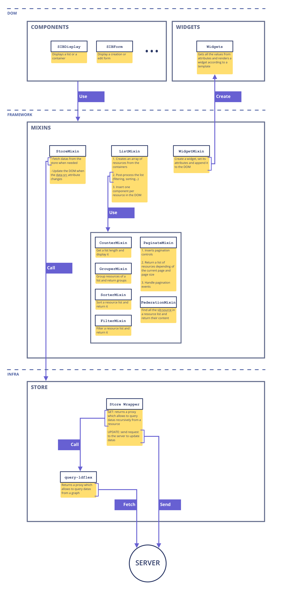
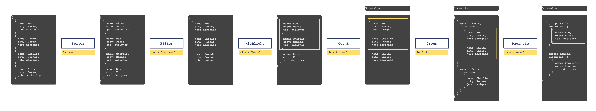
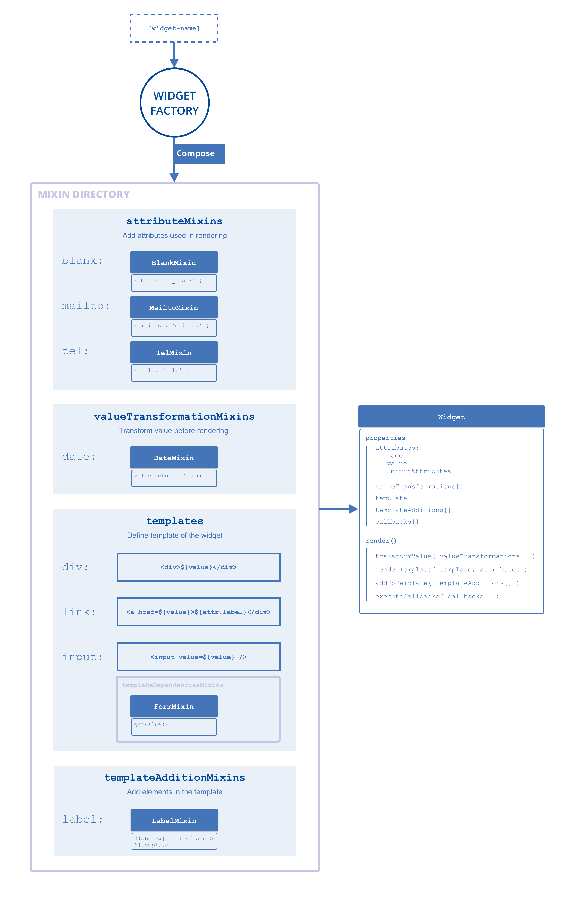

# Getting started

> Before you begin, please review [our contribution guidelines](https://git.startinblox.com/documentation/doc/wikis/Contribution-guidelines):)

This documentation is intended for developers who wish to contribute to the core of the framework.

**If you are looking to use the framework, please refer to [the general documentation](https://docs.startinblox.com).**

## Installation
To start developing in `sib-core`, you need:
```shell
# 1. Install the dependencies
npm install

# 2. Build the framework
npm run build

# 3. Build and watch together
npm run dev
```

You can now see examples at [http://127.0.0.1:3000](http://127.0.0.1:3000/).


## Adding new features
To develop new features for `sib-core`, you can add an HTML example file in `/examples` directory and link it in `/index.html`.
Don't forget to import the framework:

```html
<script type="module" src="../src/index.ts"></script>
```
You can now write HTML using `sib-core` and test it in your browser.

## Documentation

- **[Store API Documentation](./docs/store.md)** - Comprehensive guide to the StartinBlox Store API, including data retrieval, manipulation, and advanced querying capabilities.

## Testing

You can test the API by running:
```shell
npm run test
```

Or alternatively, you can select the tests you would like to run by using the Cypress UI:
```shell
npm run cypress:open
```

# Mixin API
## How it works
Here is a simplified schema of how the API works to create a component:


## Name

```js
  static get name() {
    return 'string';
  }
```
The static `name` getter returns a string that will be used to register the component tag name or the mixin name. This getter is required.

## Install mixins
```js
  static get use() {
    return [Mixin];
  }
```

The static `use` getter return an array of mixins to install. The mixin compositor install mixin recursively.

## Declare attributes
```js
  static get attributes() {
    return {
      myProp: {
        type: String,
        default: '',
        callback(newValue, oldValue) {
          //
        },
        required: false,
      }
    }  
  }
```

To declare an attribute, use the static `attributes` getter. It should return an object where each property will be bound with its kebab-case equivalent. Example: `myProp` is bound to `my-prop`. Each property should be an object with the following :
- type
  - description: The JavaScript type of your attribute data
  - required: false
  - default: String
- default
  - description: A default value
  - required: false
  - default: undefined
- required
  - description: Indicates if this attribute required. If `true`,  an error is thrown if not provided
  - required: false
  - default: false
- callback
  - description: A function invoked when the attribute changed. It receives 2 arguments : `newValue`, `oldValue`.
  - required: false
  - default: undefined

The mixin compositor registers all attribute recursively, keeping the last declaration.

## Declare initial state
```js
  static get initialState() {
    return {
      click: 0,
    };
  }
```
The static `initialState`` getter should return an object containing the initial state of the component. The mixin compositor recursively merges the initial state, ensuring that the last declaration is preserved.

Every property in the initial state could be watched by the component in order to provide reactivity.


## Hooks
```js
  created() {
    console.log('component is created');
  }
```
Available hook:
- created
- attached
- detached

Each hook is a function. The mixin compositor *appends* hooks. If a deeper mixin registers a created hook, its function will be called before the current created hook.

## Declare methods
```js
  myMethod() {
    console.log('Hi!');
  }
```
To declare methods, simply add a method to your mixin. The mixin compositor retains the last declared method.

# Core Architecture
Here is a simplified schema of the organization and the responsibilities of the classes of the core classes:


## List post-processing
A `solid-display` component can show a list of resources and apply various filters to sort, group, and otherwise transform these resources. Below is a schema illustrating the sequence of these transformations:


# Widgets API
A widget is a small component responsible for managing a value. Widgets are composed and built on demand when the developer requests them. The widget name is parsed and analyzed to add the appropriate mixins. Here is a schema showing how this process works:



## Values
Values are provided to a widget through its `value` attribute. For the widgets defined by sib-core, the value can have different types:
- `string`: This is the most common and encouraged use case
- `boolean` (checkbox): The value is converted to string (`'true'` or `'false'`)
- `number` (input number): The value is converted to a string
- `container` (multiple, multiple form): The value is converted to `@id` and resolved by the widget

Custom widgets, which still use the old API, can accept the following types:
- `string`
- `resource` Proxy
- `container` Proxy

### Getting Values
With display widgets, you can retrieve the value through its HTML attribute:
```js
const value = widgetElement.getAttribute('value');
// or thanks to the core API
const value = widgetElement.component.value;
```

For form widgets, where the value can be changed by the user, you can retrieve it as follows:
```js
const value = widgetElement.component.getValue();
```

Under the hood, the core locates elements with a `data-holder`` attribute and retrieves the value from their properties, rather than their attributes, which hold the initial value of the widget.

A widget can have:
- 1 `data-holder` element (simple inputs)
- 2 `data-holder` elements (range filter inputs)
- multiple `data-holder` elements (multiple-form)


## Not clear enough ?
Help us to improve the documentation! Feel free to ask for clarification or ask questions. This helps us to improve our documentation.

Thanks you!