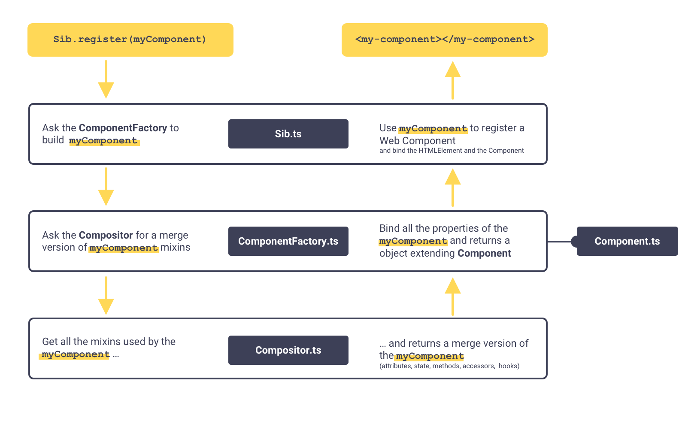

# Getting started
## Installation
To start developing in `sib-core`, you need:
```shell
# 1. Install the dependencies
npm install

# 2. Build the framework
npm run build

# 3. Launch a web server
npm run serve
```

You can now see examples at [http://127.0.0.1:3000](http://127.0.0.1:3000/).

## Adding new features
To develop new features of `sib-core`, you can add an HTML example file in `/examples` and link it in `/index.html`.
Don't forget to import the framework:

```html
<script type="module" src="../lib/src/index.js"></script>
```
You can now write HTML using `sib-core` and test it in your browser.


## Test
You can test the API by running:
```shell
npm run test
```

# Mixin API
## How it works
Here is a simplified schema of how the API works to create a component:


## Name

```js
  static get name() {
    return 'string';
  }
```
The static getter "name" return a string that will be used to register the component tag name or the mixin name. This getter is required.

## Install mixins
```js
  static get use() {
    return [Mixin];
  }
```

The static getter "use" return an array of mixins to install. The mixin compositor install mixin recursively.

## Declare attributes
```js
  static get attributes() {
    return {
      myProp: {
        type: String,
        default: '',
        callback(newValue, oldValue) {
          //
        },
        required: false,
      }
    }  
  }
```

To declare an attribute, you should use the static getter "attributes". It should return an object. Each property will be bind with kebab case equivalent. Example: 'myProp' is bound to 'my-prop'. Each property should be an object with :
- type
  - description: The js type of your attribute data
  - required: false
  - default: String
- default
  - description: A default value
  - required: false
  - default: undefined
- required
  - description: Is this attribute required, if true, throw an Error if not provided
  - required: false
  - default: false
- callback
  - description: A function that will be invoke when the attribute changed. It receive 2 arguments : newValue, oldValue.
  - required: false
  - default: undefined

The mixin compositor register all attribute recursively. The last declaration is keeped.

## Declare initial state
```js
  static get initialState() {
    return {
      click: 0,
    };
  }
```
The static getter initialState should return an object that contains initial state of the component. The mixin compositor merge recursively the initial state. Last declaration is keeped.
Every property in the initial state could be watched by the component in order to provide reactivity.


## Hooks
```js
  created() {
    console.log('component is created');
  }
```
Available hook:
- created
- attached
- detached

Each hook is a function. The mixin compositor *append* hooks. If a deeper mixin register a created hook, its function will be called before the current created hook.

## Declare methods
```js
  myMethod() {
    console.log('Hi!');
  }
```
In order to declare methods, you just add a method to your mixin. The mixin compositor keep the last method declared.
