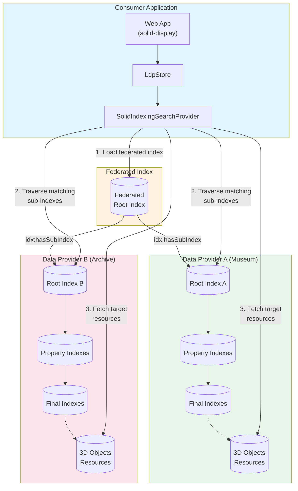
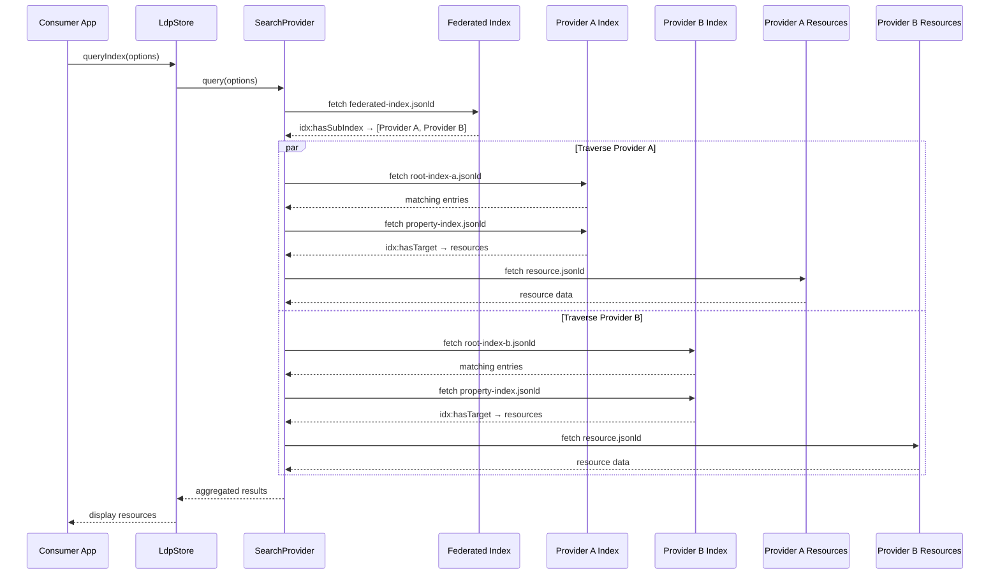

# Indexing-Based Search in Startin'Blox

This document describes the indexing-based search system implemented in `@startinblox/core`, which enables efficient traversal of distributed Linked Data resources using SHACL-based indexes.

## Overview

The indexing-based search provides an efficient way to search across large datasets without loading all resources into memory. Instead of querying each resource individually, the system traverses a hierarchical index structure that narrows down candidates based on search criteria, using SHACL (Shapes Constraint Language) shapes for validation.

This implementation is based on the [Solid Indexing Specification](https://wimmics.github.io/solid-start/specs/solid-indexing/index.html), which defines the concepts and vocabulary for creating traversable indexes over Linked Data resources.

### Key Benefits

- **Efficient traversal**: Only loads index files and matching resources, not the entire dataset
- **Distributed data support**: Works with data spread across multiple servers
- **SHACL-based validation**: Uses standardized shape validation for matching
- **Pattern and exact matching**: Supports both prefix-based patterns and exact value matching
- **Conjunction queries**: Can combine multiple search criteria

## Architecture Overview

The following diagram illustrates how a consumer application using `@startinblox/core` interacts with a federated index system spanning multiple data providers:



### Federated Search Flow

1. **Consumer initiates search**: The application triggers a search via `solid-display` with `filtered-on="index"`
2. **Load federated index**: The `SolidIndexingSearchProvider` loads the federated root index
3. **Discover provider indexes**: The federated index contains `idx:hasSubIndex` links to each data provider's root index
4. **Parallel traversal**: The provider traverses each data provider's index hierarchy in parallel
5. **SHACL validation**: At each level, SHACL shapes determine which branches match the search criteria
6. **Resource fetching**: Final indexes point to actual resources via `idx:hasTarget`, which are fetched and returned

### Sequence Diagram



## Architecture Components

### 1. Index Hierarchy

The system uses a three-level index hierarchy:

```
Root Index (e.g., 3DObjects-index.jsonld)
    └── Property Indexes (e.g., 3DObjects-title-index.jsonld)
        └── Final Indexes (e.g., titles/rom.jsonld)
            └── Target Resources (e.g., 3DObjects/100.jsonld)
```

### 2. Core Classes

| Class | Location | Purpose |
|-------|----------|---------|
| `SolidIndexingSearchProvider` | `src/libs/store/search/SolidIndexingSearchProvider.ts` | Main search provider that queries indexes using SHACL shapes |
| `LdpStore` | `src/libs/store/impl/ldp/LdpStore.ts` | Store implementation with `queryIndex()` method |
| `FilterMixin` | `src/mixins/filterMixin.ts` | Component mixin handling the `filtered-on="index"` attribute |

### 3. External Dependencies

The system leverages the Semantizer ecosystem:

- `@semantizer/mixin-index` - Index factory and entry stream transformer
- `@semantizer/util-index-querying-strategy-shacl-final` - SHACL-based querying strategy
- `@semantizer/util-shacl-validator-default` - SHACL shape validator
- `N3` - Turtle parser for SHACL shapes

## Index Structure

### Root Index

The root index (`idx:Index`) defines which properties are searchable and points to property-specific sub-indexes.

```json
{
  "@context": "https://cdn.startinblox.com/owl/context-bis.jsonld",
  "@graph": [
    {
      "@type": "idx:Index",
      "@id": "http://example.com/3DObjects-index.jsonld"
    },
    {
      "@id": "http://example.com/3DObjects-index.jsonld#target",
      "sh:path": "rdf:type",
      "sh:hasValue": { "@id": "tc:3DObject" }
    },
    {
      "@id": "http://example.com/3DObjects-index.jsonld#title",
      "@type": "idx:IndexEntry",
      "idx:hasShape": {
        "@type": "sh:NodeShape",
        "sh:closed": "false",
        "sh:property": [
          { "@id": "http://example.com/3DObjects-index.jsonld#target" },
          { "sh:path": "tc:title" }
        ]
      },
      "idx:hasSubIndex": "http://example.com/3DObjects-title-index.jsonld"
    }
  ]
}
```

**Key elements:**
- `idx:Index` - Marks the document as an index
- `idx:IndexEntry` - An entry pointing to a sub-index
- `idx:hasShape` - SHACL shape describing what this entry indexes
- `idx:hasSubIndex` - URL of the next-level index

### Property Index (Sub-Index)

Property indexes partition resources by property value prefixes (typically 3 characters).

```json
{
  "@context": "https://cdn.startinblox.com/owl/context-bis.jsonld",
  "@graph": [
    {
      "@type": "idx:Index",
      "@id": "http://example.com/3DObjects-title-index.jsonld"
    },
    {
      "@id": "http://example.com/3DObjects-title-index.jsonld#rom",
      "@type": "idx:IndexEntry",
      "idx:hasShape": {
        "@type": "sh:NodeShape",
        "sh:closed": "false",
        "sh:property": [
          { "@id": "http://example.com/3DObjects-title-index.jsonld#target" },
          { "sh:path": "tc:title", "sh:pattern": "rom.*" }
        ]
      },
      "idx:hasSubIndex": "http://example.com/titles/rom.jsonld"
    }
  ]
}
```

**Key elements:**
- `sh:pattern` - Regex pattern for matching (e.g., `rom.*` matches titles starting with "rom")
- Each entry points to a final index containing matching resources

### Final Index (Leaf)

Final indexes contain direct references to target resources.

```json
{
  "@context": "https://cdn.startinblox.com/owl/context-bis.jsonld",
  "@graph": [
    {
      "@id": "http://example.com/titles/rom.jsonld",
      "@type": "idx:Index"
    },
    {
      "@id": "http://example.com/titles/rom.jsonld#target",
      "@type": "sh:NodeShape",
      "sh:closed": "false",
      "sh:property": [
        { "sh:path": "rdf:type", "sh:hasValue": { "@id": "tc:3DObject" } },
        { "sh:path": "tc:title", "sh:pattern": "rom.*" }
      ]
    },
    {
      "@id": "http://example.com/titles/rom.jsonld#0",
      "@type": "idx:IndexEntry",
      "idx:hasShape": "http://example.com/titles/rom.jsonld#target",
      "idx:hasTarget": "http://example.com/3DObjects/100.jsonld"
    }
  ]
}
```

**Key elements:**
- `idx:hasTarget` - Direct URI of the matching resource

## Component Usage

### Basic Usage with `solid-display`

```html
<solid-display
  filtered-by="search-form-id"
  filtered-on="index"
  data-src-index="https://api.example.com/indexes/objects-index.jsonld"
  data-rdf-type="tc:3DObject"
  fields="title, description"
>
</solid-display>

<solid-form-search
  id="search-form-id"
  fields="tc:title"
  submit-button="Search"
></solid-form-search>
```

### Required Attributes

| Attribute | Description |
|-----------|-------------|
| `filtered-by` | ID of the `solid-form-search` element |
| `filtered-on="index"` | Enables index-based search mode |
| `data-src-index` | URL of the root index document |
| `data-rdf-type` | RDF type of resources being searched (e.g., `tc:3DObject`) |

### Alternative: Profile-Based Discovery

Instead of specifying the index URL directly, you can use profile-based discovery:

```html
<solid-display
  filtered-by="search-form-id"
  filtered-on="index"
  data-src-profile="https://example.com/profile.jsonld"
  data-rdf-type="tc:3DObject"
>
</solid-display>
```

The profile document should contain:
1. A `foaf:PersonalProfileDocument` with `foaf:primaryTopic`
2. A `solid:publicTypeIndex` pointing to a type index
3. The type index should contain an `idx:Index` registration

## Search Flow

### 1. Query Initiation

When a user submits a search form, the `FilterMixin` captures the form values and calls `triggerIndexSearch()`:

```typescript
async triggerIndexSearch(filterValues: Record<string, any>) {
  const queryOptions: IndexQueryOptions = {
    dataSrcProfile: this.dataSrcProfile,
    dataSrcIndex: this.dataSrcIndex,
    dataRdfType: this.dataRdfType,
    filterValues,
  };

  const results = await store.queryIndex(queryOptions);
  // Results are stored in local container and displayed
}
```

### 2. SHACL Shape Generation

The `SolidIndexingSearchProvider` dynamically generates three SHACL shapes based on the query:

1. **Target Shape** - Identifies matching index entries with the search pattern
2. **Sub-Index Shape** - Identifies entries that point to sub-indexes (for traversal)
3. **Final Shape** - Identifies entries that point to target resources

### 3. Index Traversal

Using the generated shapes, the system:

1. Loads the root index
2. Uses SHACL validation to find matching entries
3. Follows `idx:hasSubIndex` links to sub-indexes
4. Continues until reaching final indexes with `idx:hasTarget` links
5. Fetches and returns the target resources

### 4. Pattern Matching

For search patterns, the provider extracts a 3-character prefix:

```typescript
// Input: "Roman Architecture"
// Clean: "roman architecture"
// Prefix: "rom"
// Pattern: "rom.*"
```

## API Reference

### IndexQueryOptions

```typescript
interface IndexQueryOptions {
  dataSrcProfile?: string;     // Profile URL for index discovery
  dataSrcIndex?: string;       // Direct index URL
  dataRdfType: string;         // RDF type to filter (e.g., "tc:3DObject")
  filterValues: Record<string, any>;  // Form field values
  exactMatchMapping?: Record<string, boolean>;  // Fields requiring exact match
}
```

### ConjunctionQueryOptions

For multi-field searches:

```typescript
interface ConjunctionQueryOptions {
  dataSrcProfile?: string;
  dataSrcIndex: string;
  dataRdfType: string;
  filterValues: Record<string, any>;  // Multiple fields
  useConjunction?: boolean;
  exactMatchMapping?: Record<string, boolean>;
}
```

### Store Methods

```typescript
// Single-field query
async queryIndex(options: IndexQueryOptions): Promise<any[]>

// Multi-field conjunction query (AND logic)
async queryIndexConjunction(options: ConjunctionQueryOptions): Promise<any[]>
```

## Endpoint Requirements

### Index Endpoints

Servers hosting indexes must:

1. Serve JSON-LD documents with proper `Content-Type: application/ld+json`
2. Support CORS for cross-origin requests
3. Use the `idx:` namespace (`https://ns.inria.fr/idx/terms#`)
4. Include proper SHACL shapes with `sh:` namespace

### Resource Endpoints

Target resource endpoints should:

1. Return JSON-LD formatted resources
2. Include the RDF type specified in `data-rdf-type`
3. Support the properties used in search fields

## Creating Indexes

### Index Generation Requirements

To create an index structure:

1. **Analyze your data** - Identify searchable properties
2. **Choose partitioning** - Typically 3-character prefixes for text fields
3. **Generate the hierarchy**:
   - Root index with entries for each searchable property
   - Property indexes partitioned by value prefixes
   - Final indexes linking to actual resources

### Example Structure

```
/indexes/
├── objects-index.jsonld          # Root index
├── objects-title-index.jsonld    # Title property index
├── objects-country-index.jsonld  # Country property index
├── titles/
│   ├── rom.jsonld               # Titles starting with "rom"
│   ├── med.jsonld               # Titles starting with "med"
│   └── ...
├── countries/
│   ├── croatia.jsonld           # Resources in Croatia
│   ├── bulgaria.jsonld          # Resources in Bulgaria
│   └── ...
```

## Namespaces

| Prefix | URI | Description |
|--------|-----|-------------|
| `idx` | `https://ns.inria.fr/idx/terms#` | Index vocabulary |
| `sh` | `http://www.w3.org/ns/shacl#` | SHACL constraints |
| `rdf` | `http://www.w3.org/1999/02/22-rdf-syntax-ns#` | RDF vocabulary |
| `ldp` | `http://www.w3.org/ns/ldp#` | Linked Data Platform |

## Troubleshooting

### Common Issues

1. **No results returned**
   - Verify the index URL is accessible
   - Check that `data-rdf-type` matches the indexed type
   - Ensure search field names match property paths in indexes

2. **Index validation errors**
   - Verify SHACL shapes are properly formatted
   - Check that `@context` is correctly referenced

3. **CORS errors**
   - Ensure index servers have proper CORS headers
   - Use same-origin indexes when possible

### Debug Logging

Enable Semantizer logging to trace index traversal:

```typescript
SEMANTIZER.getConfiguration().enableLogging();
SEMANTIZER.getConfiguration().registerLoggingEntryCallback(
  (logEntry) => console.log(logEntry.level, logEntry.message)
);
```

## Related Documentation

- [Solid Indexing Specification](https://wimmics.github.io/solid-start/specs/solid-indexing/index.html) - The foundational specification for the indexing concepts used in this implementation
- [SHACL Specification](https://www.w3.org/TR/shacl/)
- [JSON-LD Specification](https://www.w3.org/TR/json-ld11/)
- [Linked Data Platform](https://www.w3.org/TR/ldp/)
- [Semantizer Project](https://github.com/semantize)
