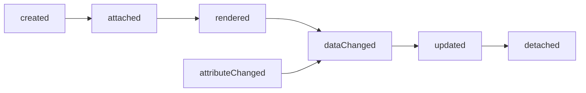

## Component API
### Static methods
#### use()
Return an array of mixins used in your component.
#### get attrs()
Return an array of string that represents the attributes watched by your component.
#### get selector()
Return a selector string

### Methods
#### get template()
Return a HTML string of your template

#### Hooks methods
- created
- attached
- detached
- rendered
- updated
See more in component lifecycle


### Example
```js
class MyCustomElement extends SIBComponent {
  static get use() {
      return [Resource]
  }

  static get attrs() {
    return ['test'];
  }

  static get selector() {
    return 'my-custom-element';
  }

  get template() {
    return '<div>bonjour</div>';
  }

  created() {
    console.log('Your component is created !');
  }

  attached() {
    console.log('Your component is attached');
  }
}
MyCustomElement.install();
```
### HTML API
#### sib-template-selector
When attribute "sib-template-selector" is set on a Sib element, the value of the attribute is used to select a template from dom.

Example:
```html
<template id="component">
  ...
</template>
<my-component sib-template-selector="#component"></my-component>
```
#### sib-value
When attribute "sib-value" is set on a DOM element, the inner of this element will be the value of the data path set on attribute.

Example:
```html
<h1 sib-value="title"></h1>
```

#### sib-attribute
When attributes "sib-attribute" is set on a DOM element, every attribute prefixed by "sib-attribute:{attribute}" will be set as value of the data path set on attribute.

Example:
```html
</img>
```

### Mixins
#### Resource
The resource mixin add an attribute watched : "sib-resource-uri".
When this attribute is set on a component which have the mixin installed, every property returned by the store is watch and available on DOM.

Example:
```html
<template id="#user-card">
  <div>
    <h2>
      <span sib-value="first_name"></span>
      <span sib-value="last_name"></span>
    </h2>
  </div>
</template>
<app-user-card
  sib-resource-uri="https://myapp/users/1/"
  sib-template-selector="user-card"
></app-user-card>
```

#### Container
Container mixin add a named slot called "sib-container-repeat" and a special attribute "sib-container-repeat".
When attribute "sib-container-uri" is set on a component which have the container mixin, every property returned by the store is watch and available on DOM.

Example:
```html
<template id="#user-list">
  <ul>
    <slot name="sib-container-repeat">
      <app-user-card
        sib-container-repeat="sib-resource-uri"
        ></app-user-card>
    </slot>
  </ul>
</template>
<app-user-list
  sib-resource-uri="https://myapp/users/"
  sib-template-selector="user-list"
></app-user-card>
```

## Component lifecycle

- created : called when the component constructor is called
- attached: called when the component is attached to DOM
- rendered : called when the component is first rendered
- attributeChanged : called when the component's attribute is mutated
- dataChanged: called when a property is mutated
- updated: called when component DOM is updated
- detached: called when component is detached from DOM

## Data events
### dataChanged
- Name : dataChanged:{property} where {property} = name of the property updated
- Detail :
  - oldValue
  - value
